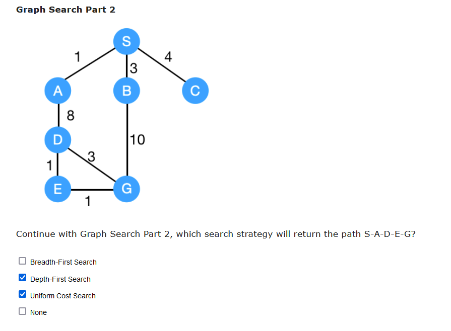
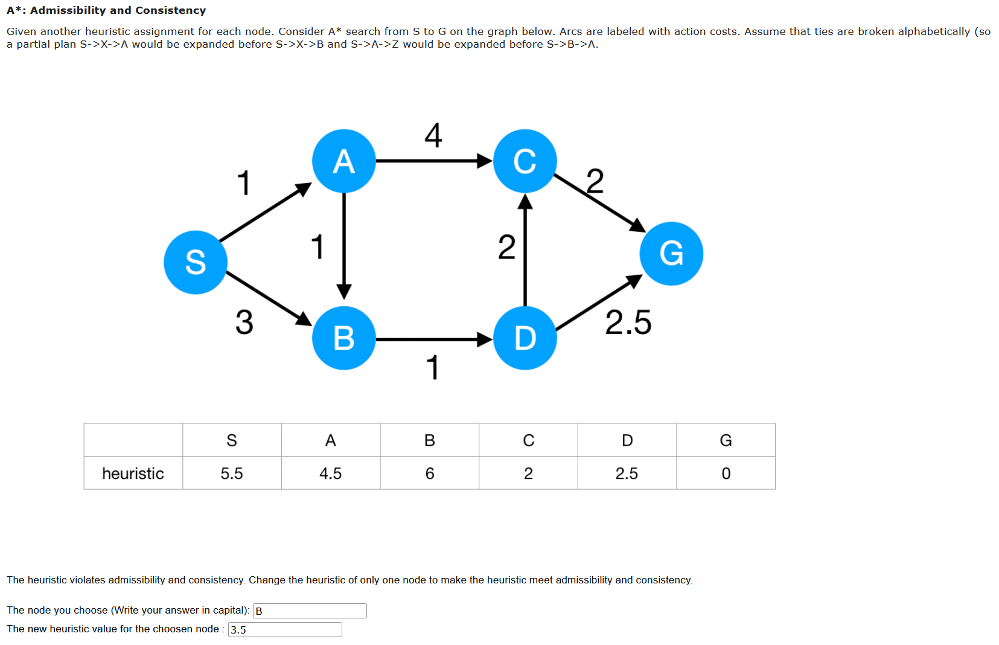
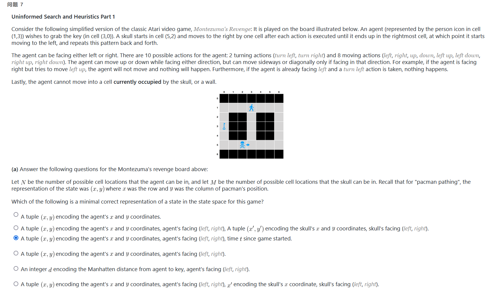
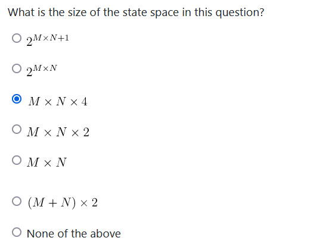
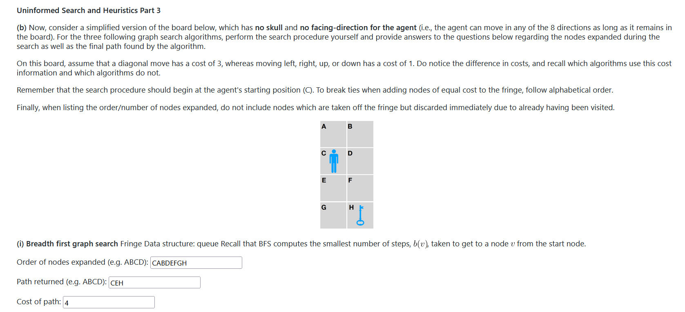
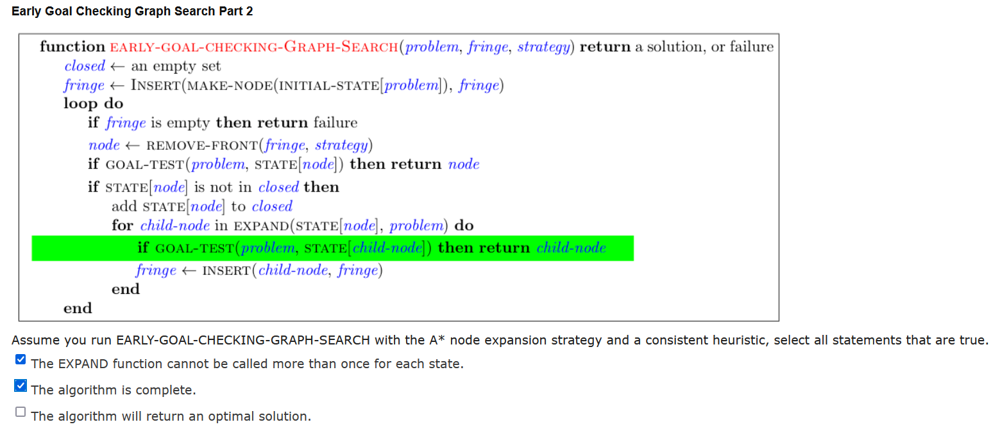
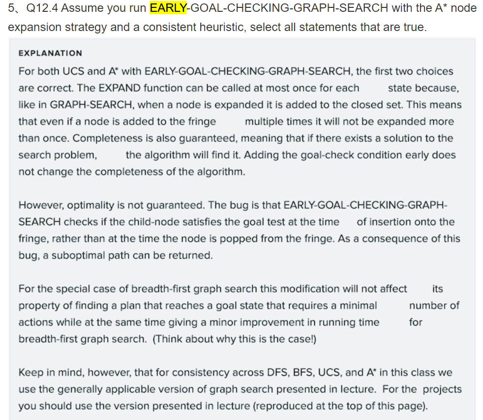
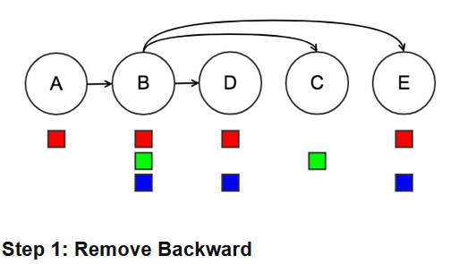
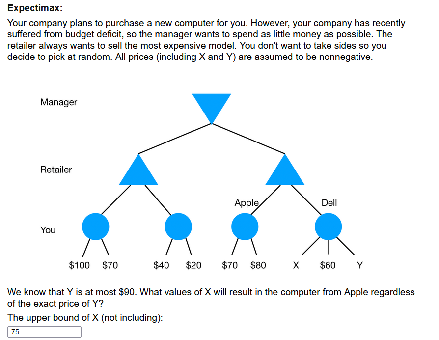

## HW1

1.BFS

2.DFS(not sure, if S-A-D-E-G-B ?) UCS

3.A-C-F-G

4.A-B-E-D-C-G

5.A-C-G

6.

<=1+2.5!

7.agent's x y agent's facing time started

8.MxNx4

9.CABDEFGH CEH 4

10.11011122

11.CADEBFGH CDFH 3

12.12011223

13.S-G

14.

15. i v vi

16. A 11 13 22 23 B 13 23 C 11 12 13 21 22 23 D 12 13 21 23

17. A 13 22 23 B 13 23 C 11 12 13 21 22 23 D 12 13 21 23

18. A 13 22 23 B 13 23 C 12 13 22 23 D 12 13 21 23

19. A 13 22 23 B 13 23 C 12 13 22 23 D 12 13 21 *:tail->head

20. B

21. 23

22. A r B rb C g D rb E rb

    

23.rbgrr remember alphabet order

24.

(60+90+x)/3<=(70+80)/2

25.3223